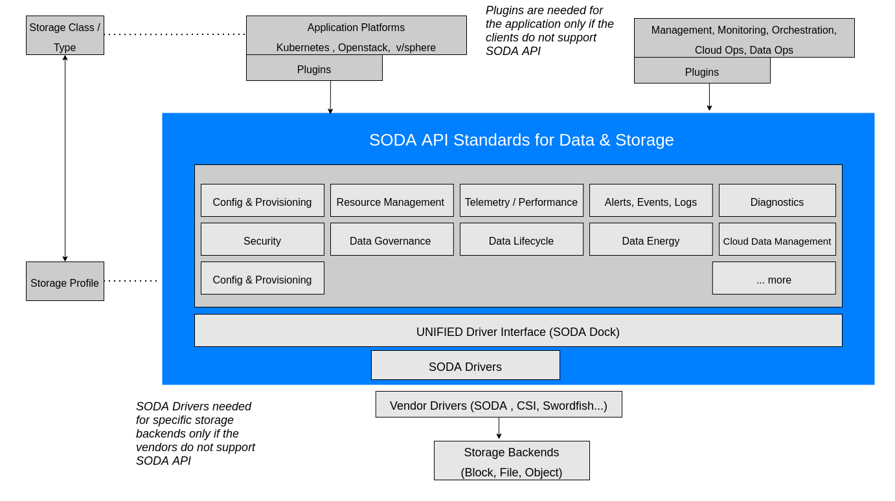

## SODA API Standards for Data and Storage

### Introduction
**SODA API Standards for Data and Storage** are an umbrella API Standards comprising of a collection of
multiple data and storage API specifications released by the SODA Foundation (under Linux
Foundation). It provides unified RESTful API interfaces with standardized data models for data and
storage across the edge, core(on-prem), and cloud. It will consolidate, update, or develop API
definitions to provide unified, extensible, and open industry standards collaborating with partners,
vendors, and standard associations.
It will have the universal application with needed customization as per the country, region and other
legal needs where it is used/deployed

#### Overall Scope
SODA API Standards for Data and Storage aim to put together a set of specifications that would be:
Unified | Open | Vendor-neutral | Platform agnostic | Environment aware | Extensible
This document provides the latest versions of all API specifications under SODA API Standards for Data and
Storage.

#### Audience
Main audience members are (not limited to) SODA API Standards Team, API Specification Software
implementors, Platform&Vendors who want to utilize SODA API for their solutions.

#### API Specifications

**Unified API for On-Prem**
Provides all the API Specifications for on-premise data and storage operations or services. It provides APIs for
block, file and object storage types in different use case domains.

- **Block and File Data Management API Specifications**

    **API View** : https://www.apimatic.io/apidocs/soda-block-file

    **API YAML** : https://github.com/sodafoundation/api/blob/master/openapi-spec/swagger.yaml

- **Infrastructure Management API Specifications**
  
    **API View** : https://www.apimatic.io/apidocs/soda-infra-manager

    **API YAML** : https://github.com/sodafoundation/delfin/blob/master/openapi-spec/swagger.yaml

- **Unified API for Multi-Cloud**
Provides all the API Specifications for cloud data and storage operations or services. It provides APIs for block,
file, and object storage(s3 compatible) types in different use case domains.

    **API View** : https://www.apimatic.io/apidocs/soda-multi-cloud

    **API YAML** : https://github.com/sodafoundation/multi-cloud/blob/master/openapi-spec/swagger.yaml

#### Software Implementation of API Specifications

**Unified API for On-Prem**

- **Block and File Data Management API Specifications**
    https://github.com/sodafoundation/api

- **Infrastructure Management API Specifications**
    https://github.com/sodafoundation/delfin

- **Unified API for Multi-Cloud**
    https://github.com/sodafoundation/multi-cloud

{}Download SODA API Draft - v0.0.1{}