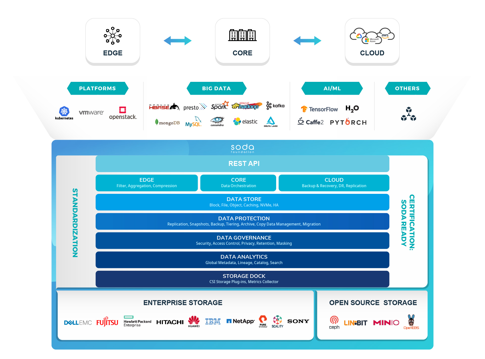

## SODA Framework
[SODA Foundation](https://sodafoundation.io) is a home for multiple projects for building a unified data framework to support various data and storage solutions. SODA Framework provides a single data framework with infinite possibilites. It brings all the scattered data and storage solutions under a single framework ecosystem of projects.

## SODA Architecture
The high level SODA Architecture and various project constituting this architecture is available at:
- [SODA Framework Architecture](https://github.com/sodafoundation/design-specs/blob/master/SODAFrameworkAndSODAProjects.md)

