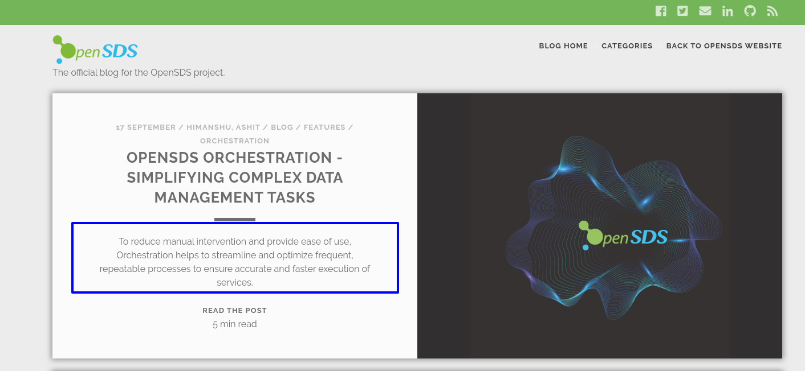

{}
The blog website is based on Hugo/Netlify.  
Install Hugo version 0.55.6 from [here](https://github.com/gohugoio/hugo/releases/tag/v0.55.6) and instructions can be found [here](https://gohugo.io/getting-started/installing/)  
To see a locally running preview use the command `hugo server` from the doc root.  
The blog is based on the [Nederburg Theme](https://github.com/appernetic/hugo-nederburg-theme) for Hugo. 
{}  

## 1. Fork and Clone
  - Fork the blog repository from [here](https://github.com/sodafoundation/blog).  
  - Clone the fork.  

```
cd blog
#The blog website uses the [Nederburg theme](https://github.com/appernetic/hugo-nederburg-theme) for Hugo. It is added as a git submodule and needs to be initialized.
git submodule --init --recursive
```
## 2. Add writer  

If you are going to contribute regularly you can add yourself as an author on the blog repository. In the root directory navigate to the `config.toml` file. Look for the section  `[params.writers]` and add your bio.  The format looks like the following:  

```toml
[params.writers]
  [params.writers."Anvith KS"]
    link = "https://example.io/"
    email = "your@email.com"
    bio = [
      "This is the author bio shown after posts."
    ]
    facebook      = "full profile url in facebook"
    googleplus    = "full profile url in googleplus"
    twitter       = "full profile url in twitter"
    linkedin      = "full profile url in linkedin"
    stackoverflow = "full profile url in stackoverflow"
    instagram     = "full profile url in instagram"
    github        = "full profile url in github"
    pinterest     = "full profile url in pinterest"
```

 Here is an example of a front matter entry for the writer defined above.

```toml
writer = "Anvith KS"
```  
### Alternative method to add a writer  

Alternatively you can just add your details in the post front matter.

```toml
...
writer = "Anvith KS"
writer_link = "https://example.io/"
writer_email = "your@email.com"
writer_bio = "Anvith is an avid blogger and the founder of <a href='https://example.io/'>Example.io</a>. This is the author bio shown after posts."
writer_twitter = "https://twitter.com/<yourhandlehere>"
...
```

It will override the author in the config. If you have not added yourself to the author list then you will have to add your details to every blog entry.

## 3. Adding a new post  

Navigate to the `content\post\` folder. Create a new file and follow the naming convention as `YYYYMMDD-filename.md` .  
At the beginning of the post add the front matter between `+++` including the `+++`. The front matter format is as follows:  

```toml
+++
#If you want to keep the post in draft state set this to `true`
draft = false
#For the featured image visible on the post list page. Put the image in the `static/img/` folder.
image = "img/orchestration-arch-design.png"
#The post date in GMT +5.30
date = "2019-09-17T10:30:00+05:30"
#Post Title
title = "SODA Foundation Orchestration - Simplifying Complex Data Management Tasks"
#The slug is visible in the URL and helps make the URL readable.
slug = "orchestration-simplifying-complex-data-management-tasks"
#Post Description. Max 200 characters.
description = "To reduce manual intervention and provide ease of use, orchestration helps to streamline and optimize frequent, repeatable processes to ensure accurate and faster execution of services."
#Add writers here. If the writer is already added to the config.toml file then just add a reference to the name and the details will be picked up.  
#Else the details will have to be added. Follow the add writer alternative method above.
writer = "Himanshu, Ashit"
#The blog categories. Add the categories to which the post belongs. If the category does not exist then add a new one.
categories = [ "Blog", "Features", "Orchestration"]
#Add related tags
tags = ["orchestration"]
+++
```

## 4. Adding post excerpt  

The post excerpt is visible in the post listing page. This content is derived from the first 200 characters of the article immediately after the end of the front matter `+++` and end with `<!-- more -->`.
For example:  

```
...
categories = [ "Blog", "Features", "Orchestration"]
tags = ["orchestration"]
# weight = 1
+++  

To reduce manual intervention and provide ease of use, Orchestration helps to streamline and optimize frequent, repeatable processes to ensure accurate and faster execution of services.
<!-- more --> 
#Remove the space before and after `more`
...
```  




## 5. Adding post content  

- Please use standard markdown formatting to write your post.
- Use blockquotes to highlight sections of importance.
- Avoid using first level heading (#).
- Use second level headings (##) for important sections.
- Use URL hyperlinking with readable titles for long URLS. for example  
{}
  [Click here](https://github.com/sodafoundation/orchestration/blob/master/docs/INSTALL.md) for the SODA Foundation Orchestration Manager Installation:  
  *instead of*    
  Click Here [https://github.com/sodafoundation/orchestration/blob/master/docs/INSTALL.md](https://github.com/sodafoundation/orchestration/blob/master/docs/INSTALL.md) for the SODA Foundation Orchestration Manager Installation:  
{}
- To include images in the post use the standard markdown way to display images. Place the images under the `/static/img/` folder and link using the relative path. For Example:  
  ```
  #Usage: 
  
  ``` 
- Alternatively you can also use the hugo shortcode `figure`. 

  ```
  # Usage: 
  # Remove the space after the {{ and before the }}
  {{ < figure src="/img/orchestration-arch-design.png" title="SODA Foundation Orchestration Manager Architecture diagram" > }}
  ``` 
- More Hugo Shortcodes for content management can be found [here](https://gohugo.io/content-management/shortcodes/)

## 6. Run a local build (optional)

Run the following commands in the root directory to view the site locally. You can  verify the content and styling is as per the style guide before raising the PR.
```
hugo server
```
## 7. Raise a PR  
- After the blog is written raise a pull request to the `master` branch on the `opendsds/blog` repository. 
- Netlify will create a preview build and the actual page can be viewed in this preview.  
- The blog will be reviewed by atleast 2 reviewers which may include one technical writer and one developer.  
- After the blog is reviewed and merged it will be added as the latest post and can be viewed at [blog.sodafoundation.io](http://blog.sodafoundation.io)
