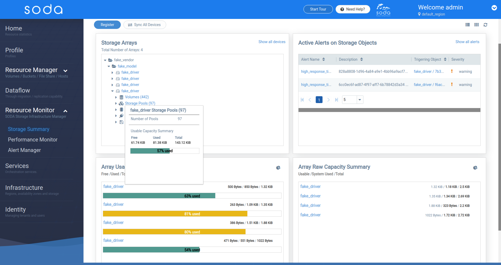

delfin (Dolphin in Spanish!), the SODA Infrastructure Manager project is an open source project to provide unified, intelligent and scalable resource management, alert and performance monitoring. It covers the resource management of all the storage backends & other infrastructures under SODA deployment. It also provides the alert management and metric data(performance/health) for monitoring and further analysis.

It provides unified APIs to access, export and connect with clients as well as a set of interfaces for various driver additions. These APIs combined with the SODA Dashboard provide a graphical interface that allows users to manage storage backends and visualize the metrics and health.

### Delfin Features
- [Register a Storage Device](#register-storage-device)
    - [REST Access](#rest-access)
    - [SSH Access](#ssh-access)
- [Storage Summary](#storage-summary)
- [Storage Device Actions](#storage-device-actions)
    - Update access Info
    - Configure Alert Source
    - Remove Alert Source
    - Sync Storage Device
    - Configure Metric collection
    - Delete Storage Device
- [Storage Device Details](#storage-device-details)
- [Performance Monitor](#performance-monitor)
- [Alertmanager](#alertmanager)

### Register Storage Device  
##### [\[Back to top\]](#delfin-features)  

Currently supported vendors include `Dell EMC`, `Huawei`, `HPE`, `Hitachi`, `IBM`.  
To register a storage device select one of the Vendor and one of the models listed.

Depending on the vendor and model enter the access info. Delfin supports both REST and SSH methods.  

#### REST Access
##### [\[Back to top\]](#delfin-features)  

{}
**For devices that utilise the REST access mechanism the following parameters are needed:**  
    - **Host IP**: IP address of the storage device  
    - **Port**: Port on the device which is accessible  
    - **Username**: Valid username  
    - **Password**: Valid Password  
{}

#### SSH Access
##### [\[Back to top\]](#delfin-features)  

{}
**For devices that utilise the REST access mechanism the following parameters are needed:**  
    - **Host IP**: IP address of the storage device  
    - **Port**: Port on the device which is accessible  
    - **Username**: Valid username  
    - **Password**: Valid Password  
    - **Public Key Type**: Delfin supports public key authentication of SSH. Valid Pub key types are `ssh-ed25519`, `ecdsa-sha2-nistp256`, `ecdsa-sha2-nistp384`, `ecdsa-sha2-nistp521`, `ssh-rsa`, `ssh-dss`.   
    - **Public Key**: valid public key based on the type selected.  
{}

### Storage Summary 
##### [\[Back to top\]](#delfin-features)  

The storage summary page is an aggregated view of all the storage devices, alerts, usable and raw capacities.

This is where you view the storage summary
1. Tree View Widget: all storage devices
2. List all alerts summary widget
3. Array usable capacity widget
4. Array Raw capacity widget
5. Toggle List view / Grid view
6. List view : All storage devices
7. List View : All active alerts

### Storage Device Actions
##### [\[Back to top\]](#delfin-features)  

All the actions that can be performed by the user on storage devices
Actions are available in the right-click menu in tree view and by clicking on "More" under the operations column in the list view table.
1. Update access Info
2. Configure Alert Source
3. Remove Alert Source
4. Sync Storage Device
5. Configure Metric collection
6. Delete Storage Device

### Storage Device Details
##### [\[Back to top\]](#delfin-features)  

This is where you view the storage device details
1. Configuration :  Basic details
    - Volumes
    - Storage Pools
    - Controllers
    - Ports
    - Disks
2. Capacity: Capacity summary for the storage device
3. Alerts: All generated alerts for the storage device if alert source is specified.
4. Performance Monitoring: Visualization of metrics using graphs if performance monitoring is enabled.

### Performance Monitor
##### [\[Back to top\]](#delfin-features)  

This is where you view the performance monitoring information across the storage devices

### Alertmanager
##### [\[Back to top\]](#delfin-features)  

This button launches the Alertmanager UI.

