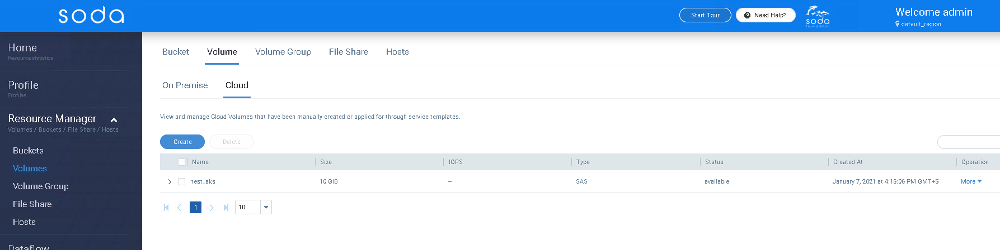
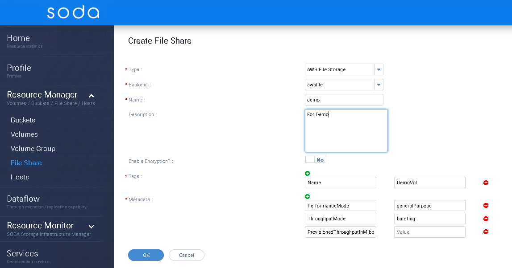
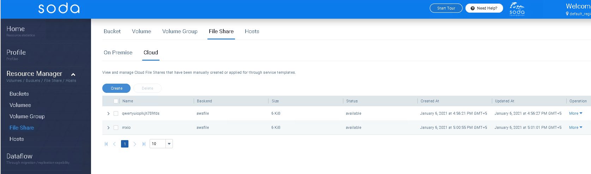

## Introduction to File and Block storage service in multi-cloud
SODA Multicloud provides a cloud vendor agnostic data management for hybrid cloud, intercloud, or intracloud. The goal is to provide a unified interface to support file, block, and object services across multiple cloud vendors.

Details about the design and use cases can be found at: [multi-cloud File storage](https://github.com/sodafoundation/architecture-analysis/blob/master/arch-design/multicloud/File_Storage_Service.md) and [multi-cloud block storage](https://github.com/sodafoundation/architecture-analysis/blob/master/arch-design/multicloud/Block_Storage_Service.md)

## Getting Started
This guide shows how to use the File and Block storage services of multi-cloud to create and manage cloud volumes and cloud fileshares. This will illustrate the operations through SODA Dashboard.

To refer the API specs, please check [multi-cloud API specs](https://github.com/sodafoundation/multi-cloud/blob/master/openapi-spec/swagger.yaml)

##### Supported metrics as of now:

|Cloud Vendor|Block|File|
|--------|----|-----|
|AWS|EBS|EFS|
|Azure|-|File share|
|Huawei|EVS|EFS|
|GCP|-|Filestore|

## Installing SODA multi-cloud
Please refer [SODA installation using Ansible](https://docs.sodafoundation.io/soda-gettingstarted/installation-using-ansible/)
Or Check the developer guide [multi-cloud lcoal cluster installation through repo](https://docs.sodafoundation.io/guides/developer-guides/multi-cloud/)

##### SODA Dashboard UI can be accessed via
	http://{your_host_ip}:8088/#/home

##### login using the default admin credentials: 
	admin/opensds@123 

## Register Backend

##### Create  new backend  using remote cloud bucket
Click on (+) for registering a storage backend. Choose appropriate backend type for Block or File storage

## Create Cloud Volume

* Go to **Resource Manager -> Volumes -> Cloud**
* Click on **Create** button
* Select appropriate backend Type from **Type** drop down
* Select corresponding Backend name registered from **Backend** drop down
* Fill required details for creating the volumes

{}
Tags and Metadata need to be chosen appropriately
{}

## List, Modify and Delete Cloud Volumes
##### Listing
* Go to **Resource Manager -> Volumes -> Cloud**
You can find the list of Cloud Volume

##### Modify
* Go to **Resource Manager -> Volumes -> Cloud**
* Select the volume to be modified
* From **Operation** column, select **Modify** form the **More** option
You can choose to modify the volume attributes

##### Delete
* Go to **Resource Manager -> Volumes -> Cloud**
* Select the volume to be deleted
* From **Operation** column, select **Delete** form the **More** option
The volume should be deleted

## Create Cloud File Share

* Go to **Resource Manager -> File Share -> Cloud**
* Click on **Create** button
* Select appropriate backend Type from **Type** drop down
* Select corresponding Backend name registered from **Backend** drop down
* Fill required details for creating the file share

{}
Tags and Metadata need to be chosen appropriately
{}

## List, Modify and Delete Cloud fileshare
##### Listing
* Go to **Resource Manager -> File Share -> Cloud**
You can find the list of Cloud File Shares

##### Modify
* Go to **Resource Manager -> File Share -> Cloud**
* Select the File Share to be modified
* From **Operation** column, select **Modify** form the **More** option
You can choose to modify the File Share attributes

##### Delete
* Go to **Resource Manager -> File Share -> Cloud**
* Select the File Share to be deleted
* From **Operation** column, select **Delete** form the **More** option
The File Share should be deleted

> Please note that the volume or file share attributes, metadata and tags are compatible with Cloud vendors. Please refer cloud vendor docs for more details

