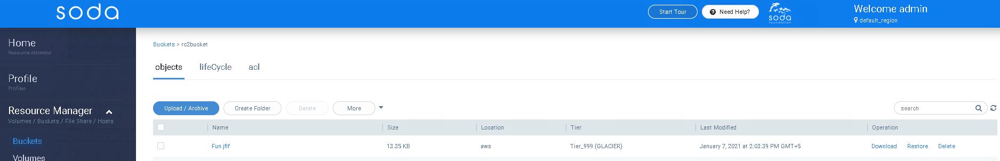

## Introduction to Object archival and retrieval
SODA Multicloud provides a cloud vendor agnostic data management for hybrid cloud, intercloud, or intracloud. The goal is to provide a unified interface to support file, block, and object services across multiple cloud vendors.

Archiving data which is important but intermittently used, is valuable to keep it safe and also save cost and resource.
Retrieving the archived data whenever required as per need and also retrieving it when the local data is lost is an important requirement for Availability and Business continuity.
More details about the architecture and use cases can be found at [ObjectArchivalRestore](https://github.com/sodafoundation/architecture-analysis/tree/master/arch-design/multicloud)

## Getting Started
This guide shows how to archive objects into Cloud object storage and restore them as and when required, meeting the SLAs. This will illustrate the operations through SODA Dashboard.

To refer the API specs, please check [Cloud Object Archival API Specs](https://github.com/sodafoundation/multi-cloud/blob/master/openapi-spec/swagger.yaml)

{}
 Currently this feature is available only for AWS, Azure and GCP cloud as backend and SONY-ODA as on-premise Cold storage
{}

## Installing SODA multi-cloud
Please refer [SODA installation using Ansible](https://docs.sodafoundation.io/soda-gettingstarted/installation-using-ansible/)
Or Check the developer guide [multi-cloud local cluster installation through repo](https://docs.sodafoundation.io/guides/developer-guides/multi-cloud/)

##### SODA Dashboard UI can be accessed via
	http://{your_host_ip}:8088/#/home

##### login using the default admin credentials: 
	admin/opensds@123 

## Pre-requisite
* Cloud Backend is registered. [How to register a cloud backend](/guides/user-guides/multi-cloud/object-archival-restore/#how-to-register-a-cloud-backend)
* multi-cloud Bucket is created. [How to create a multi-cloud bucket](/guides/user-guides/multi-cloud/object-archival-restore/#how-to-create-a-multi-cloud-bucket)

#### How to register a Cloud backend

##### Create  new backend  using remote cloud bucket
Click on (+) for registering a storage backend

#### How to create a multi-cloud bucket
After creating new backend follow the steps given below to create a bucket:

* Launch **Resource Manager -> Buckets** from SODA home page
* Create a new bucket with appropriate backend. Click *Create* button
	

## Archive the Object into this bucket

* Go to the bucket 
* Click on **Upload/Archive** button to archive an object in the selected bucket
* Select the object to be archived
* Check **Archive object?** to **Yes**
* Select appropriate **Tier** from the drop down. Please note that the Tier specifies the Storage class to which the object will be archived to
* Submit
	

## Listing the archived object
On the respective bucket page, you can find the archived object. multi-cloud Tier for the archived object should be **Tier_999(GLACIER)**
	

## Restoration of archived object
Archived object in cloud need to be restored or brought back to the appropriate storage class before being downloaded. This depends upon the feature and SLAs from the cloud vendors
To restore an object:

* Select the object and click on **Restore** from the **Operation** column of the object
* From the **Restore** wizard, select the number of **Days** for which the object will be available for restore or the restore link is available
* Select the **Retrieval Tier**. Please refer the Cloud vendor docs for more details on the **Retrieval Tier** and the SLAs and costing for the same
* Click *OK* 
	
{}
Once the restoration of object is inititated, it may take time for the availability of the object to be downloaded. Refer cloud vendor docs for the availability corresponding to the chosen Retrieval Tier
{}

## Download of archived object
Once the restoration of object is complete, the object can be downloaded by clicking on the **Download** Operation
	

