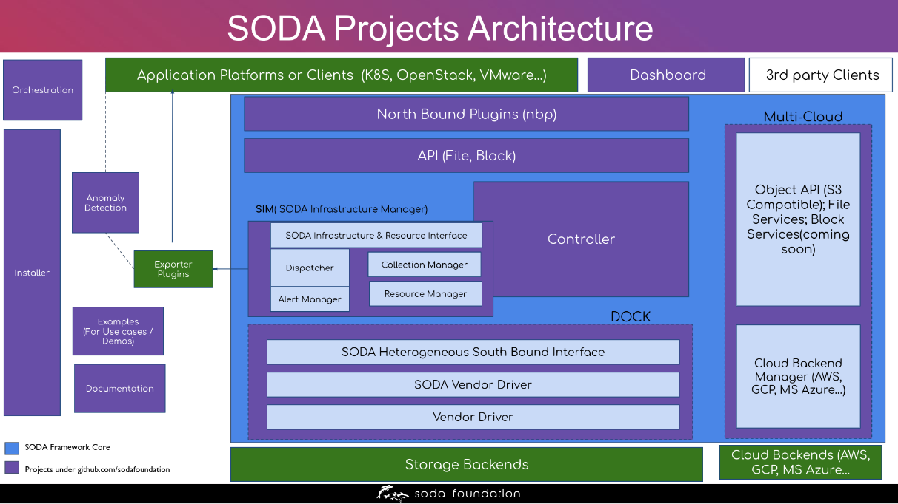

[SODA Foundation](https://sodafoundation.io) is a home for multiple projects for building a unified data framework to support various data and storage solutions. Here is a brief description of all the projects maintained by SODA Foundation.

<!-- Soda Project Architecutre Diagram -->

{}

- ### SODA Plugin

    SODA Plugins enable awareness and seamless integration between SODA and compute platforms or application frameworks.

    SODA provides plugins for Kubernetes, OpenStack and VMWare.

     [SODA Cloud Native Storage For Kubernetes CSI](https://sodafoundation.io/projects/soda-plugins/kubernetes/)

     [SODA Cinder Block & Manila File Services For OpenStack](https://sodafoundation.io/projects/soda-plugins/openstack/)

     [SODA VASA For Vmware](https://sodafoundation.io/projects/soda-plugins/vmware/)

     [Support Matrix](https://docs.sodafoundation.io/projects/nbp/support-matrix/)

- Source code for other projects are maintained under [SODA Foundation github organization](https://github.com/sodafoundation)
